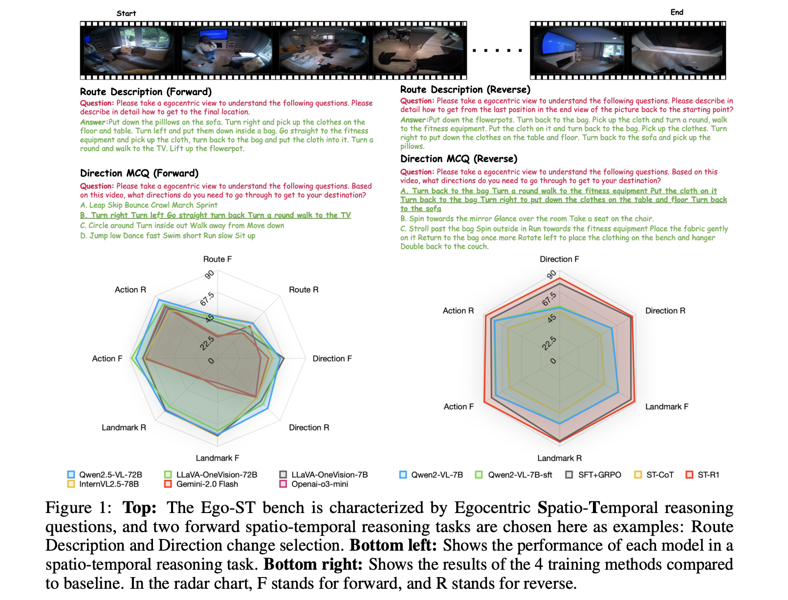

#  ST-Think: How Multimodal Large Language Models Reason About 4D Worlds from Ego-Centric Videos


<p align="left">
  <a href="https://arxiv.org/abs/2503.12542" target='_**blank**'>
    
  </a> 
  <a href="https://huggingface.co/datasets/openinterx/Ego-ST-bench" target='_blank'>
    
  </a>
</p>

<p align="center">
    
</p>

## Abstract
Humans excel at spatio-temporal reasoning, effortlessly interpreting dynamic visual
events from an egocentric viewpoint. However, whether multimodal large language
models (MLLMs) can similarly comprehend the 4D world remains uncertain.
This paper explores multimodal spatio-temporal reasoning from an egocentric
perspective, aiming to equip MLLMs with human-like reasoning capabilities. To
support this objective, we introduce Ego-ST Bench, a novel benchmark containing
over 5,000 question-answer pairs across four categories, systematically evaluating spatial, temporal, and integrated spatio-temporal reasoning. Additionally, we
propose ST-R1 Video model, a video-based reasoning model that incorporates
reverse thinking into its reinforcement learning process, significantly enhancing
performance. We combine long-chain-of-thought (long-CoT) supervised finetuning with Group Relative Policy Optimization (GRPO) reinforcement learning,
achieving notable improvements with limited high-quality data. Ego-ST Bench
and ST-R1 provide valuable insights and resources for advancing video-based
spatio-temporal reasoning research.

## TODO and Timeline

### TODO

- :fire: We will release ST-R1 training code, where the entire cold start and GRPO training process can be completed **using 4 x H100 GPUs**.
- :fire: We are planning to train the 16 frames version.


### Timeline

- :fire: We have released the **benchmark datasets and inference code**
- :fire: We have released the **ST-R1 Model Checkpoints**


### Inference

Infer the QwenVL model (Note: go into qwen-vl-utils source code in the enviroment package, and change the vision_process.py)

```python

def fetch_video(ele: dict, image_factor: int = IMAGE_FACTOR, return_video_sample_fps: bool = False) -> torch.Tensor | list[Image.Image]:
    # import pdb; pdb.set_trace()
    if isinstance(ele["video"], str):
        video_reader_backend = get_video_reader_backend()
        try:
            video, sample_fps = VIDEO_READER_BACKENDS[video_reader_backend](ele)
        except Exception as e:
            logger.warning(f"video_reader_backend {video_reader_backend} error, use torchvision as default, msg: {e}")
            video, sample_fps = VIDEO_READER_BACKENDS["torchvision"](ele)
        
        # import pdb; pdb.set_trace()

        nframes, _, height, width = video.shape

        # change the max frames
        frame_indices = torch.linspace(0, nframes-1, 8).long()

        video = video[frame_indices]

        min_pixels = ele.get("min_pixels", VIDEO_MIN_PIXELS)
        total_pixels = ele.get("total_pixels", VIDEO_TOTAL_PIXELS)
        max_pixels = max(min(VIDEO_MAX_PIXELS, total_pixels / nframes * FRAME_FACTOR), int(min_pixels * 1.05))
        max_pixels_supposed = ele.get("max_pixels", max_pixels)
        if max_pixels_supposed > max_pixels:
            logger.warning(f"The given max_pixels[{max_pixels_supposed}] exceeds limit[{max_pixels}].")
        max_pixels = min(max_pixels_supposed, max_pixels)
        if "resized_height" in ele and "resized_width" in ele:
            resized_height, resized_width = smart_resize(
                ele["resized_height"],
                ele["resized_width"],
                factor=image_factor,
            )
        else:
            resized_height, resized_width = smart_resize(
                height,
                width,
                factor=image_factor,
                min_pixels=min_pixels,
                max_pixels=max_pixels,
            )
        video = transforms.functional.resize(
            video,
            [resized_height, resized_width],
            interpolation=InterpolationMode.BICUBIC,
            antialias=True,
        ).float()

        # import pdb; pdb.set_trace()
        print(f'video shape {video.shape}')

        if return_video_sample_fps:
            return video, sample_fps
        return video
    else:
        assert isinstance(ele["video"], (list, tuple))
        process_info = ele.copy()
        process_info.pop("type", None)
        process_info.pop("video", None)
        images = [
            fetch_image({"image": video_element, **process_info}, size_factor=image_factor)
            for video_element in ele["video"]
        ]
        nframes = ceil_by_factor(len(images), FRAME_FACTOR)
        if len(images) < nframes:
            images.extend([images[-1]] * (nframes - len(images)))
        if return_video_sample_fps:
            return images, process_info.pop("fps", 2.0)
        return images
```

Then run the code.

```
python ./infer_code/ST-R1_mcq/mcq_infer.py
```
